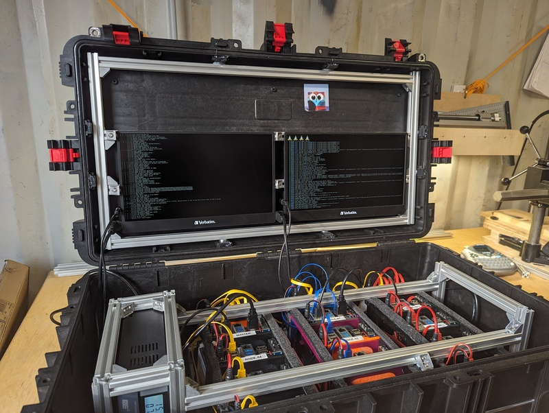
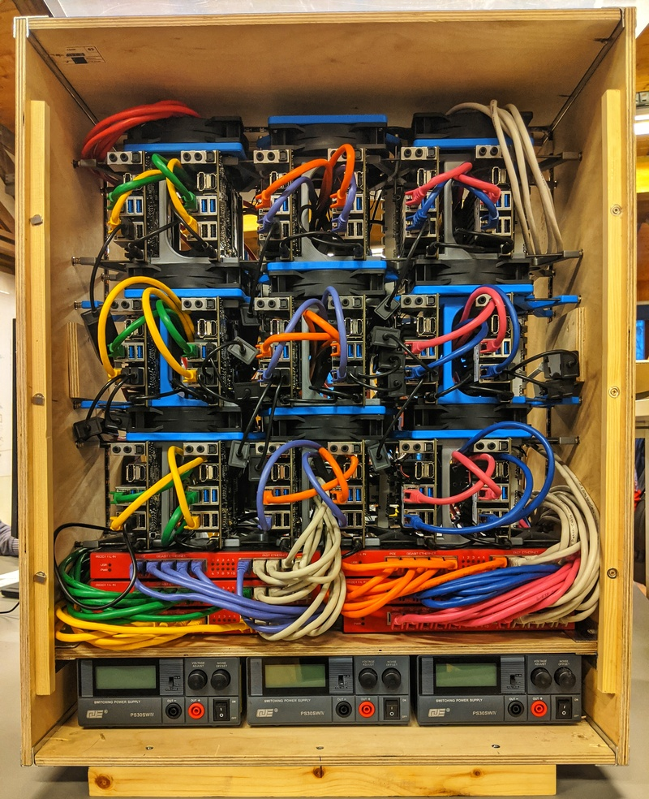
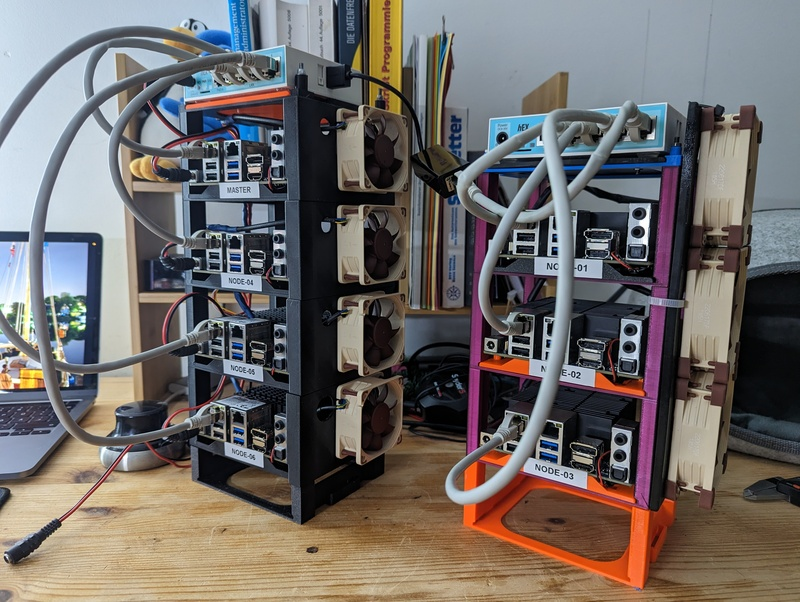

# cluster-in-a-box

Buiilding a Demo / Lab K8S Cluster in a easy and secure transportable box.

After my first attempt of building a [18 node lab
cluster](#the-18-node-lab-cluster) for an former company and some back and
forth with the [stacked odroids](stackrack.md) i saw a 6 nodes kubernetes
cluster in a [pelicase style](https://www.peli.com/) rugged case on the
KubeConEu Paris 2034 booth of [BrainGu](https://braingu.com/).

FIXME: Ask Tim from BrainGu for permission to show a picture of his setup.

I directly started to think how i could build something similar based on my
[Odroids](hardware.md).

This is my documentation about the build process, what i considered, what i
**not** considered, what worked, what turned out not working at all for anybody
else who thinks to do similar stuff.

I will also try to list the costs. 

Spoiler: This is an expensive project with questionable benefit.

## Learning from the past

### The 18 node lab cluster 

was considered to simulate our production bare metal setup in three different
DC locations, having the same full redundancy mechs (multiple switches per DC,
dedicated power supply per DC, bgp routing, hsm, bootstrapping with dedicated
origin nodes per DC and stuff like that) as the real production setup - we
wanted to train and check our assumptions.

More [pictures of figo labcluster](https://photos.app.goo.gl/ya45xb5jxJ1xBKEp7) 

Known problems:
- I built that rack by plywood and flightcase aluminium profiles, it was very
    heavy and not easy to carry. 
    
    We used that thing to find problems with our setup, but we never moved it to
    conferences or customers to showcase our setup - it was just to heavy and
    difficult to transport.
- Switches, power supplies and nodes could not be removed or changed in a easy
    way, in that case we would need a to do a lot of dissassembly work.
- The rack was not as stable from corner to a diagonal corner as expected - it had 
    no back lid to stabilize it.
- Starting with COVID-19 and working from home we
    missed a BMC to restart single nodes. I built a relay switchboard system to
    powercycle individual nodes from remote. 

### Small Stacks

with Odroids worked out really great. This model allows a small (3 to 5 node)
stack which is easy to carry around to demonstrate things.

See [stackrack](stackrack.md) for more information.

It starts to get complicated with two of them, the power supply, keyboard,
monitor, cables and some more typical supplies.

## Considerations

Learning from the experiences above and the thing Tim from BrainGu built, i want
to connect the already working small stacks with a easy to handle, rugged
container. 

## Outer shell - box

This is an extra chapter [Outer shell and boxes](box.md).

## A inner rig for the stacks 

This is an extra chapter [Inner rig](alu-rails.md).

## Connect the inner frame to the case

I am not yet sure if i want to connect the alu frame in a solid way to the case. 
But if, i needed to explore the possibilities.

This is also an extra chapter [Connect the frame with the box](frame-box-connection.md).

## Interfaces

This is a show case, so it should be possible to view and interact with the rig.

## Skills and Tools

What skills and which tools are needed to build this thing?

## Costs
