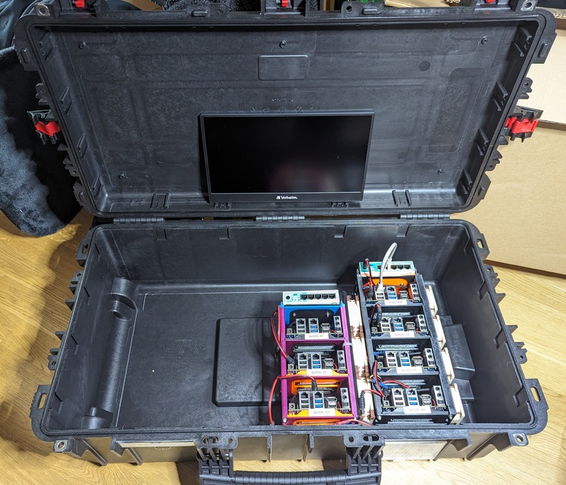

# cluster-in-a-box

Buiilding a Demo / Lab K8S Cluster in a easy and secure transportable box.

After my first attempt of building a [18 node lab
cluster](#the-18-node-lab-cluster] for an former employer and some back and
forth with the [stacked odroids](stackrack.md) i saw a 6 nodes kubernetes
cluster in a [pelicase style](https://www.peli.com/) rugged case on the
KubeConEu Paris 2034 booth of [BrainGu](https://braingu.com/).

FIXME: Ask Tim from BrainGu for permission to show a picture of his setup.

I directly started to think how i could build something similar based on my
[Odroids](hardware.md).

This is my documentation about the build process, what i considered, what i
**not** considered, what worked, what turned out not working at all for anybody
else who things to do similar stuff.

I will also try to list the costs. 
Spoiler: This is an expensive project with questionable benefit.

## Learning from the past

### The 18 node lab cluster 

was considered to simulate our production bare metal setup in three different
DC locations, having the same full redundancy mechs (multiple switches per DC,
dedicated power supply per DC, bgp routing, hsm, bootstrapping with dedicated
origin nodes per DC and stuff like that) as the real production setup - we
wanted to check and train our assumptions.

[Pictures of figo labcluster](https://photos.app.goo.gl/ya45xb5jxJ1xBKEp7) 

Known problems:
- I built that rack by plywood and flightcase aluminium profiles, it was very
    heavy and was not really easy to carry around. We used that thing to find
    problem with our setup, but we never moved it to conferences or customers
    to showcase our setup - it was just to heavy and difficult to transport.
- Switches, power supplies and nodes could not be changed in a easy way, in that case we
    would need a to do a lot of dissassembly work.
- The rack was not as stable from corner to a diagonal corner as it had no back
    lid to stabilize it.
- Starting with COVID-19 and working from home we
    missed a BMC to restart single nodes. I built a relay switchboard system to
    powercycle individual nodes from remote. 

### Small Stacks

with Odroids worked out really great. This model allows a small (3 to 5 node)
stack which is easy to carry around to demonstrate things.

See [stackrack](stackrack.md) for more information.

It starts to get complicated with two of them, the power supply, keyboard,
monitor, cables and some more typical supplies.

## Considerations

Learning from the experiences above and the thing Tim from BrainGu built, i want
to connect the already working small stacks with a easy to handle, rugged
container. 

### Container

I have some experiences in the live music / festival industry, so i am familar
with [flightcases](https://www.google.com/search?q=flightcase+pictures). Almost
all of them have wheels - they are really heavy duty
and need effort to move them around even if they are empty; you need to
protect the surroundings against their corners, you need a truck and not a car
to transport them. => No flightcase in this project.

I liked the idea of using a [PeliCase](https://www.peli.com/) or similar
solution.  They are really stable, light for the grade of protection, some of
them have wheels and a retractable handle.

There are a lot of similar but different brands - i found this [comparison -
Pelican Case Alternatives](https://www.gwp.co.uk/guides/peli-case-alternatives/)
helpful to get a first glimpse.

I aimed for a box with wheels and a handle, i do not need a swimming,
waterproof, bullet proof expedition solution which works at -20°C.

I wanted to store 3 stacks with 4 Odroids each, a power supply, switches in it, The
lid should be deep enough to hold a display or a tablet.

I made some wild measurements (my odroid stack is 330 x 170 x 170 millimeters
(yep, sorry us folks, we believe in metric measurements :-) here), so three of them
need about 510 mm) and decided to go for a box with an inner volume of about 750
x 35ß x 250 mm . 

I found the best intersection (bang for bugs) in a cases from [Explorer
Cases](https://www.explorercases.com/en/home/) - they are about half of the
price (in germany) of the Pelicases and looked sturdy enough for my purpose.  

I decided to buy a [ExplorerCase
7626HL](https://www.explorercases.com/en/products/7626hl/) in black (needed some
time to decide not to opt for the orange one) with 763 x 399 x 260 mm inner
volume, a first fitting looks like there is plenty room for three stacks and
some more in it:

This box is really sturdy, it has five self-locking latches, a retractable
handle on the backside and preformed mountpoints to connect an inner
construction to the box in base and lid (they provide suitable connectors for
these mountpoints). The hinges for the lid have some points where the have
higher friction to let the lid stay open.  I do not like the wheels, they are
made by hard plastic - i consider to change them by something with more elastic
in it.

The offical measures do not follow the spaces which are needed for the wheels
and the handle, but i predicted that with their detail drawings. 

### Inner construction 

Rails
Kleber
Nieten

#### Interfaces

Powersocket

Display

Mouse 
