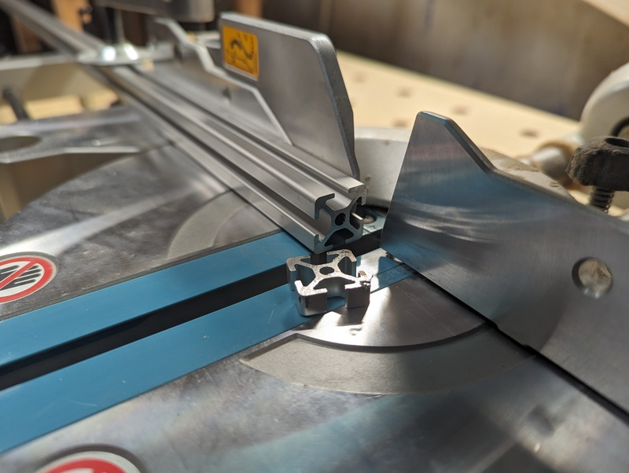
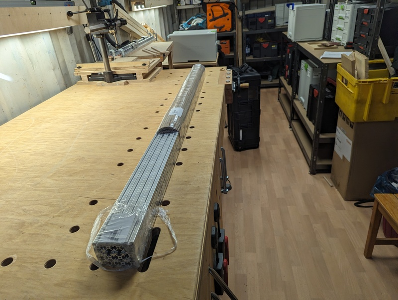
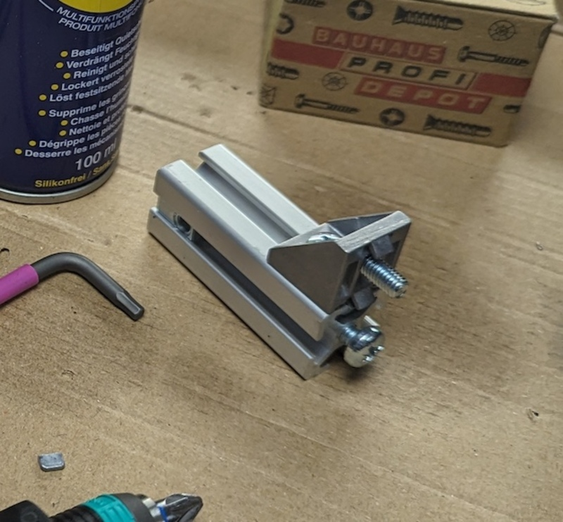
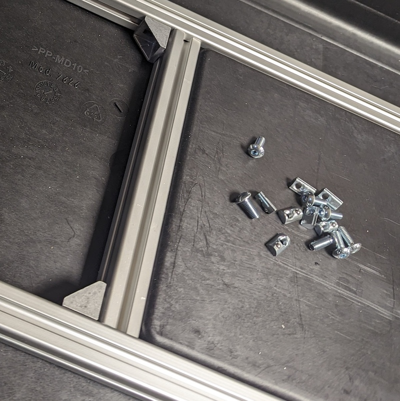
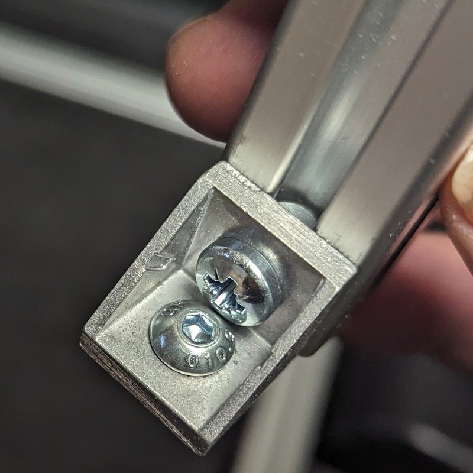

# Inner construction 

I need some material to store and connect 3 of the [Odroid stacks](stackrack.md) safely in the
box. 

I have a small wood workshop, but wood (multiplex boards and
similar) looking not suitable for this project.  I started to search for aluminium system
profiles. 

## Aluminium system profiles

These system profiles use grooves (named t-slots) on squared profiles which can
use suitable t-slot nuts with threads in them to connect to other profiles with
some specialized connector types for different connections. 

In europe are two predominant, quite similar looking but not compatible
systems present, i do not know if other markets have them also or use different
systems. 

These systems are named with a letter for the inventors (B for
[Bosch-Rexroth](https://www.boschrexroth.com/de/de/produkte/produktgruppen/montagetechnik/themen/aluminiumprofile-loesungen-komponenten/)
or I for [Item](https://www.item24.com/de-de/profiltechnik)), there are a lot
of other manufacturers which build them also, all profiles of one type are
compatible to the same system.

The differences between the systems are the shapes of the t-slots, the shapes
of the nuts and their thread diameters - from my perspective: It does not
matter which system is used, but you need to stay into the choosen system.

I found this (german) pages useful to dive into the alu profile thingie:
- [Aluprofile - Materialkunde](https://www.franzek.com/aluprofile-materialkunde)
- [Aluprofilverbinder und Nutsteine](https://www.franzek.com/aluprofilverbinder-und-nutensteine-camper-ausbau/)

The profiles are available from 20mm edge length up to 80mm, Item provides a
profile in a [wood compound
material](https://www.item24.com/de-de/profil-kh-8-40x40-anthrazit-62686) which
looks very interesting for me (it can be worked with wood sawblades and other
wood tools), but only on 40x40mm - i am very sure that 20x20 is strong enough
for this purpose.

After some wild drawings to get a somehow realistic idea how many running
meters of that profile system i would need, i decided to buy  I-type rails in
20x20mm with 5mm t-slot, the t-slot nuts with a spring loaded sphere - these
can be slotted in from the side, not only from the end.  See pictures below.
The diameter of the threads in these nuts is M5.

I ordered also plenty 90° angles and suitable (lol, read later)
screws to construct an inner cage for the odroid stacks and for the display in
the lid.

I ordered also some metal working stuff i had not so far: 
- An aluminium blade for my miter saw
- A M5 thread cutter (to grind threads into the end of a profile) and 
- A steel needle to apply marks for measurements.

I am a desperate stick welder lookalike (on agriculture equipement and other 
big game stuff) and i am able to handle an angle grinder, but i do not
consider me as a metal guy, but hey - its only Albert „Al“uminium Borland and there is also
a tools chapter later to describe that better.

### t-slot nuts

There are different types.  For me important: I need to set or remove them at
any time, even if rails are already screwed together.  There are types which
can only applied from the front side (slide in).  Other can be squeezed in
anywhere, some of them click in right in place, other needed to be fidled into
the right position and directly screwed to be manageble and not flipping in a
bad position.

### You might be screwed

Its a system. 

You just need the damn right screws - i ordered the rails, t-slot
nuts, screws, angles all together, and i ordered 12mm long screws - i learned
that this configuration needs 10mm screws.

As you might expect, this is normed (a german DIN 7380) - and it seems not
possible to get these on a saturday afternoon in a local hardware store, they
have them with a bigger head only and these colide with each other in the 90°
angles i use to connect the profiles.

I needed to stop and order the right ones. 

Does someone need 200p 12mm M5 DIN 7380 with hex head? Or 200p 10mm M5 not
normed bighead pozidrive?

## Construction

These profiles are really easy to cut with the mighty miter saw (if you running
an aluminium blade), but afterwards there are tons of saw chips everywhere -
even with proper suction.

Do your workshop a favor and run theses cuts outside - it will not polute steel
with rust.
