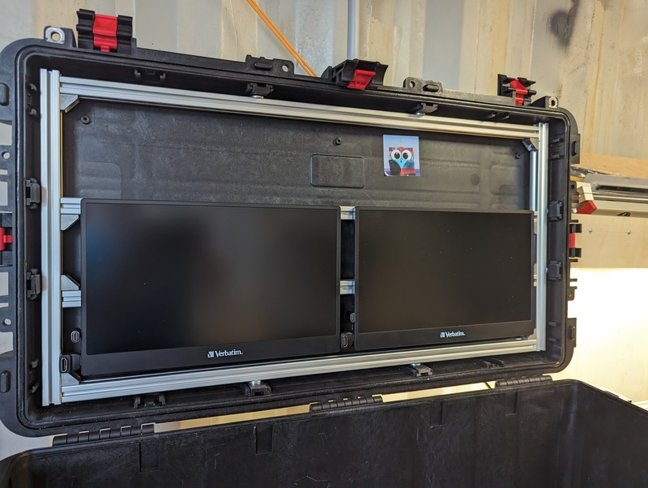

# Connect the inner cage to the case

(In the time i started to write stuff down) I was not sure yet if i want to
connect the alu frame in a solid way to the case.  It might be also possible to
establish a tight fit but no direct connection.

But if, i needed to explore the possibilities.

There are slots on the brim of the lid and the bottom, and the manufacturer has
matching hardware to slot in.

I am pretty sure that i will not use these in the
bottom, but i might use them in the lid.

Typical connections left are glueing and riveting/screwing.

## Glue

I like connections which are revertable without a heavy tools like drill or
angle grinder.

Read the last sentence again :-) But anyhow:

The case is made from polypropylene which counts as a low adhesive and hard to
bond material.  This needs special glue, i found three types:

* Acrylat based adhesive aka *super glue*, but it is not very elastic and does not fill gaps.
* [3M Scotch Weld DP 8005](https://www.google.com/search?q=3M+Scotch-Weld%E2%84%A2+DP+8005): A
    two component glue which cannot be purchased by private persons and even
    not to professional glue guys without having them a special mandatory
    security instruction. Besides that it is really expensive.
* [technicoll® 9310](https://www.technicoll.eu/adhesive/technicoll-9310-3.html): A 
    hot glue system which is easy to handle and relatively cheap.

Hot glue has special challenges in conjunction with aluminium which tends to
have a very high thermal transfer, the open time of any already applied hotglue
is very short.

I tried to hotglue the screens on to alu rails, but that did not last long (shorter than one night)

But there is one more...

* Two component glue for everything (nothing fancy, for domestic use) - most of them are not suitable 
  for pp. Anyhow - i needed one to glue the screens on the rails and used 
  [UHU Plus endfest](https://www.uhu.com/de-de/produkte/uhu-plus-endfest-doppelkammerspritze-blister),
  which did not had this warning on it (and i made the 
  [burn test to identify the type of plastic](https://mediencommunity.de/content/237-erkennen-von-kunststoffen) 
  of the display before).

The UHU 2k stuff worked fine (after removing all the hotglue and sanding (again) both sides).

## Rivets and Screws

Screwing and riveting will reduce the water tightness of the case, but i do 
not care - there are holes in it afterwards.

The box has really rugged surface on the outside, it would need good planing to
find spots with no structure elements on the outside and similar.

It might be possibe to drill holes with a template from the inside and use M5
screws with large diameter washers connecting into t-slot nuts. 

I was pretty sure not to use rivets in that case, even if i have the tools to
set proper rivets.  I like connections which are revertable without a drill.

At the end i drilled holes through the rails and the outer shell and supported
the relatively weak shell with large diameter washers.

This is just to minimize movement towards the lid - the inner rig is sitting tight
to sides and bottom already.

## Foam

I planned to add some extra support to the 3d printed odroid stacks by using
some foam between the stack and the rails.

It was not easy to find the right type, looks like there is no easy to stomach
system which describes the pressure sensivity of the different types of foam.

I found this description from [Caseclub Foam
Types](https://www.caseclub.com/different-types-of-foam-for-cases/) useful -
especially the picture with the clamp.

After buying wrong (very squeezeble) foam, i tried [Adam Hall Hardware 019310
SA](https://www.adamhall.com/shop/de-de/flightcase-material/schaumstoffe/144/019310-sa)
in two different thicknesses and spray adhesive for it.

I used it to trap the odroid cages in the alu frame (see [Fencing with
Foam](alu-rails.md#fencing-with-foam)) and tried to build a protective,
removable inlay (for transport only) between bottom and lid with the displays.

This foam can be cut with a cutter knife, but much cleaner with a hot cutter.

Even if the spray glue was exactly for this foam it was difficult to apply,
next time i would choose a liquid glue and prepare the other side of the
connection better, particulary with bare plywood (the transport layin) which
sucks the glue up.

It needed some weight to get a full laminar connection.

## Lid connectors

I used the factory prepared mountpoints in the lid to connect the rails with
the displays with my own anchor pieces.

I drawed them with
[Fusion360](https://www.autodesk.com/products/fusion-360/personal). It took 3
test print- and redesign rounds until i was satisfied with the fit, there is a
step in it and i needed a really tight fit.

These have a M5 screw which is connected with a t-nut and the alu rig.

