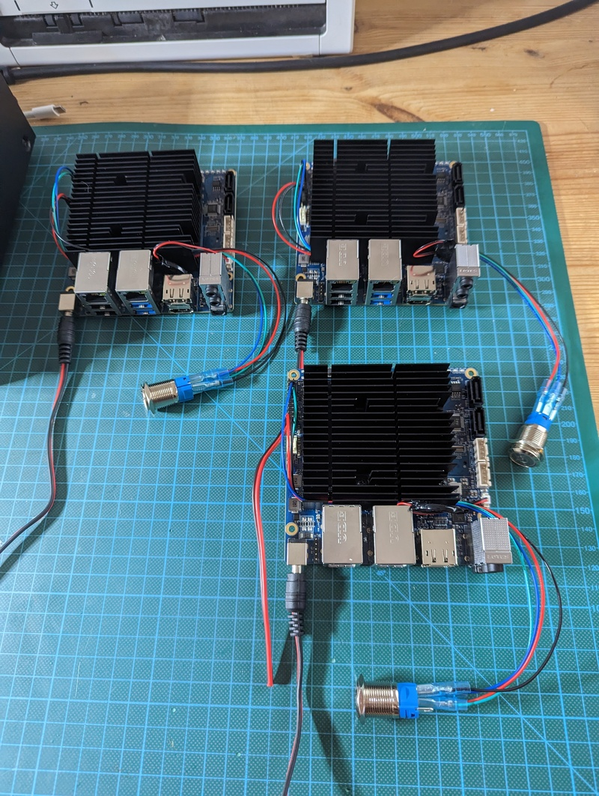
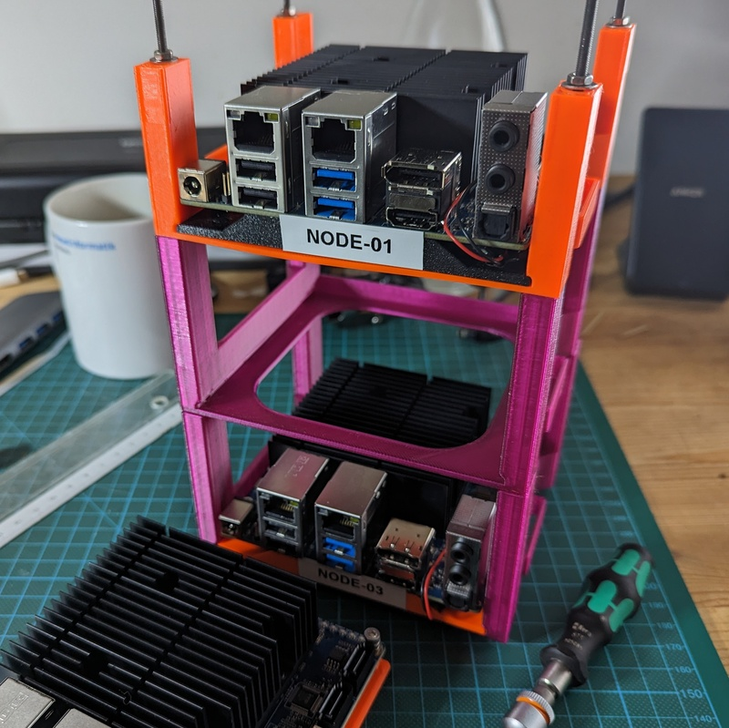
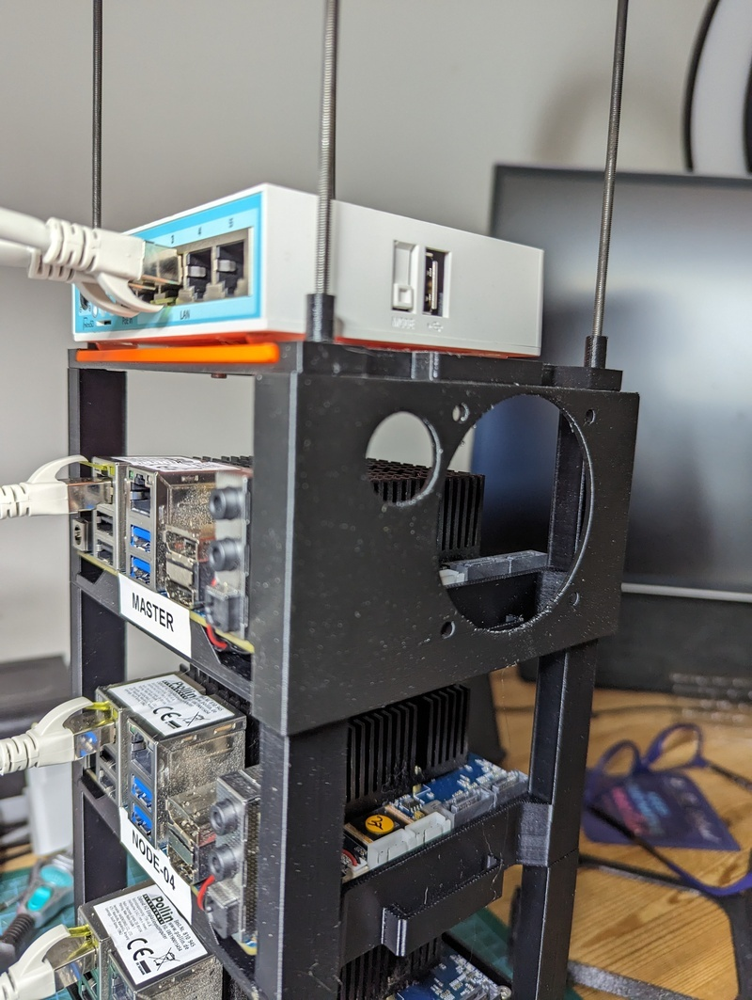
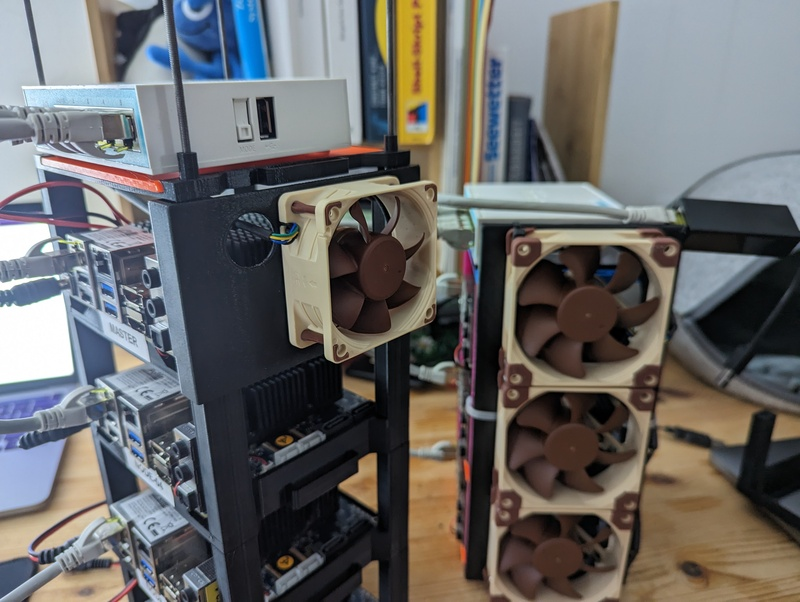
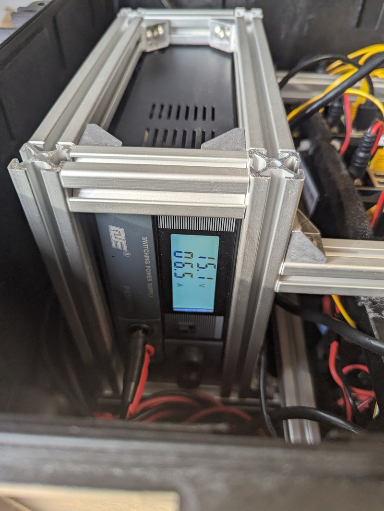
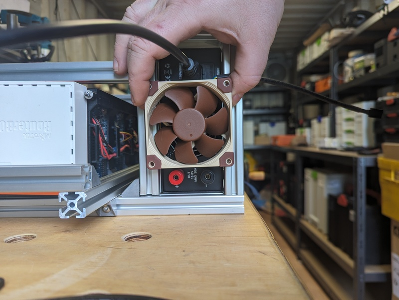
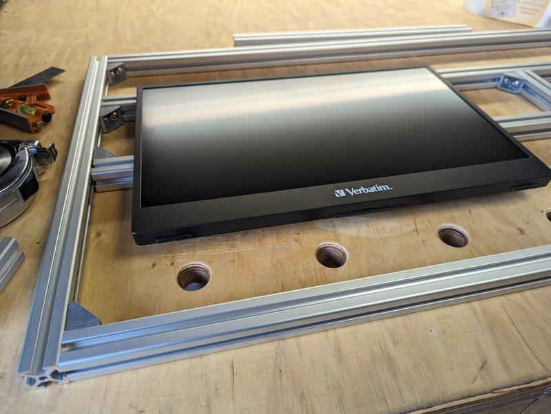
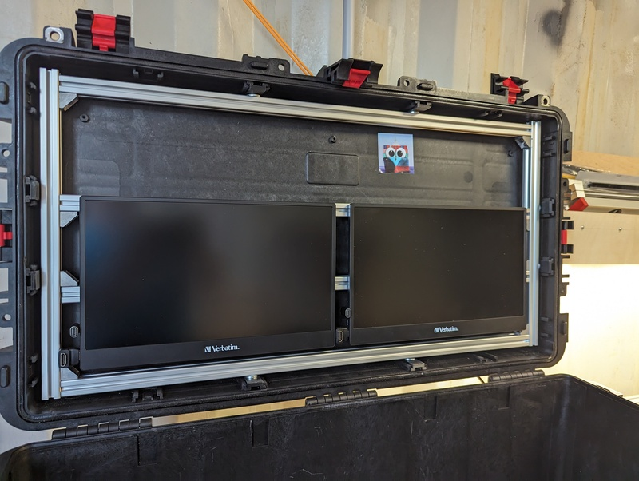

## Compute, Switch and Power Hardware

### Nodes

I bought three [Hardkernel Odroid
H3](https://www.hardkernel.com/shop/odroid-h3/); a x86_64 single board computer
with good specs:

* Intel Quad-Core Processor Jasper Lake N5105
* 2x 2.5Gbit ethernet interfaces, (i)pxe booting
* 2x S0-DIMM memory slots (up to 32 GB each)
* multiple disk options (SATA, PCIe M.2 NVMe, eMMC)
* small footprint - 110mm x 110mm 

They lack a BMC (baseboard management controller, ihlo, idrac, you name it)

First i aimed for arm64 (also known as Raspberry4, but the 8GB RAM version is
at 180 € (january 2023), if it is in stock somewhere, and its not possible to
add more RAM later. If Raspi is an option, you should head over to [Building a
bare-metal Kubernetes Cluster on Raspberry
Pi](https://anthonynsimon.com/blog/kubernetes-cluster-raspberry-pi/) and
https://github.com/christianhuening/pinetes/blob/main/README.md.

My H2 and H3 Odroids have (right now):

- 8 or 16 GB RAM (SO-DIMM)
- 256 GB M.2 2280 PCIe NVMe 
- 32 GB eMMC (on H2 nodes only)

I am already familar with the predecessor [Odroid H2 (similar specs, Celeron
CPU)](https://wiki.odroid.com/odroid-h2/start), i run a personal one at home which serves all
typical local things you need since years, and we used also Odroid H2s to build
an [18 node bare metal lab cluster at
work](https://photos.google.com/share/AF1QipPIxF5isLFw8q3Y5bL6p22sNWmxLYC7JQUArTgIg4MjGRWVMu8LyGeXqT3R3Gx_gA?key=Z1ZZc3Z1bnAxakNpbEdfRTFLbk5TWDRBNXRUal93)
to build a test environment for things which cannot be tested in kind, minikube
and other virtual envs (like simulated blackout for a complete dc, a failing
switch, storage going crazy...).

### Switch / Router

To reduce the blast radius and protect my home network i searched for a little
router to separate the home network from the lab network.  I opted for a
[MikroTik hEX RB750Gr3](https://mikrotik.com/product/RB750Gr3). MikroTiks
routerOS allows a lot of different configurations if neccessary - up to BGB and
fancy ipv6-shit.  I use one port as uplink into the home network.

The provisioning node is also an Odroid (H2 type) in the labnet.

The switches run on 8 to 30 Volts DC.

### Cooling

My personal H2 has a pwm controlled 92mm fan on the top of its case, but it barely uses
it under normal work load.

As i inherited some additional H2 nodes i decided to build a
better fitting cooling solution dedicated to each node. I needed a different
connector (4pin 1.25mm pitch) and 5V (instead of 12V as the H3). 

I created a printable fan connector [see stackrack](stackrack.md) and opted to use [Noctua
NF-A6x25 5V PWM](https://noctua.at/de/products/fan/nf-a6x25-5v-pwm) fans in it
as 60mm is the regular hight of the rackmount.

### Power Supply Unit

The Odroids drain up to 4 Amps each with two SATA disks and under full cpu load
with 15V DC, the MikroTik is also fine with 15V, so i bought a [ham radio power
supply](https://www.komerci.de/shop/stromversorgung/Festspannungsnetzgeraete/ps30swiv-festspannungsnetzgeraet-13-8v-30a-lcd)
with 15V and 30 Amps max and some 5.5 mm dc power jacks with open wires and
assembled a suitable power distribution cable.

In real live an Odroid H2/H3 with 8 or 16GB RAM and 250GB M2 'disk' consumes less than ~1A
as far as there is no real spinning SATA disk involved.

I added an external fan to the PSU - there is one in it, but bad quality and
really loud if running. The fan is just connected to the DC output.

### Display 

To be completly selfcontained i needed at least one screen or a tablet to show what happens.
It should run on the same dc power and needs hdmi to get connected.

I opted for external laptop displays which aim to run as easy to transport and
easy to connect as a 2nd display for traveling laptop users.  

They have a decent resolution and run on usb power. It was difficult to find
some with hdmi besides the really cheap chinese no-brand thingies, most of the
better types use usb-c only for signal and power.  I could not find one with
vesa type connector on the back and this small width to put them into the lid
of my container. 

I choosed [Verbatim PM-14](https://www.amazon.de/dp/B0BVL1KKK). I
am not sure if Verbatim is still a real brand, but i dont care, they are good
enough to peek into k9s or something similar.

Due the tight space i bought 90° connectors for hdmi and usb-c.

For transport (lid closed) the cables needed to removed from the screens.
