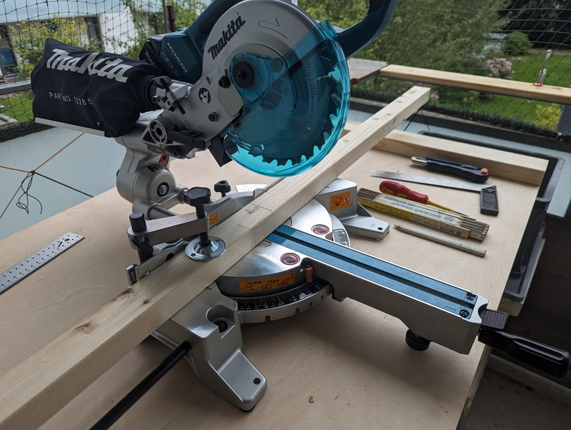

# Tools

## Cutting aluminium

To cut aluminium in the right (square) angle, you need a limit stop for your cuts.
The best way to cut it straight, is a miter saw.

You might want to cut also 45° angles, it is really difficult to get a good
repeat accuracy with a handheld saw or an angle grinder. 

If you have no miter saw - try to rent one.

I bought a [aluminum / light metal blade from
Freud](https://www.sautershop.de/kreissaegeblatt-hm-190-x-2.5/1.6-x-20-mm-z-56-fr-fr13a001h)
for my mitersaw.

These profiles are really easy to cut with the mighty miter saw (if you running
an aluminium blade), but afterwards there are tons of saw chips everywhere -
even with proper vacuum suction (DO NOT VACUUM HOT METAL CHIPS INTO YOUR WOOD
DUST COLLECTION BIN - it might burn your workshop down!)

Do your workshop a favor and run these cuts somewhere outside - the chips will not
polute any steel with rust.

I do not see any abrasion/usage signs on the sawblade after i finished all cuts.
The cuts where so good that i did not needed to file down the cuts.

## Measureing

I really like my new marking tool, a steel needle. Very thin line for accurate cuts.

Use a good square to run the marks.

To measure the right lenght i used a tape measure. Its more accurate while it has
its own limit stop at one end and its more easy to handle in a confined space
than a folding rule. 

## Hand tools

Nothing special. 

A hex / allen key, some screwdrivers.

## Drill, Thread cutter

Aluminium and Polypropylene are easy to drill materials. I used my default hss
metal drill bits and a cheap thread cutter from the local hardware store and a
cordless drill.

## 3d printer

I run a 3d printer, but i do not feel it as my hobby to configure and tweak 3d
printers to the max.

I just want to build prototypes, so i run a [Prusa
MK3S](https://www.prusa3d.com/de/kategorie/original-prusa-i3-mk3s/). Someone
else tweaked them before selling them.

![prusa](pics/
I started with drawing pieces in 2017 with Fusion360, and while i am used to it, i 
never changed to more open software. 

## Hot cutter

This is expensive for a single use event. I had one for other purposes already
and used it.  If you are in soldering, looking for a suitable blade for your
soldering iron. I know that at least Ersa  has some.

Its also possible to use a sharp cutter knife.

## Hot glue pistol

Do not use hotglue with aluminum until you are able to preheat it.  The 2nd is
dangerous, and i tried it without. Aluminium will eat up all heat from the glue
directly and the open time of the glue is nearly no time. 
